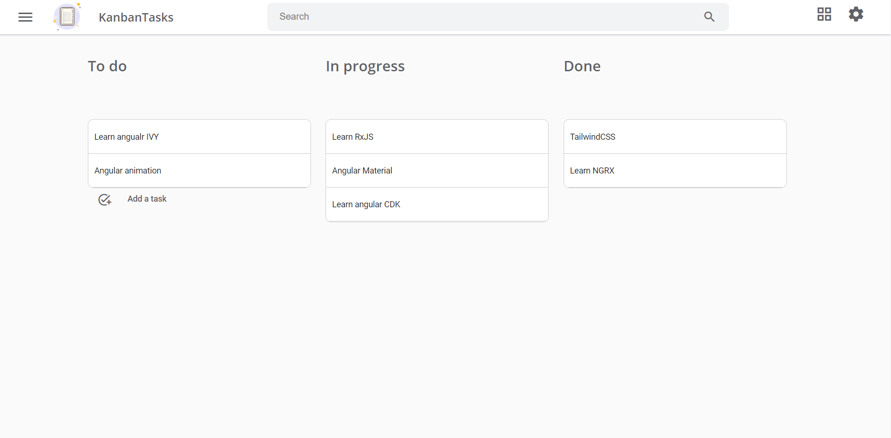
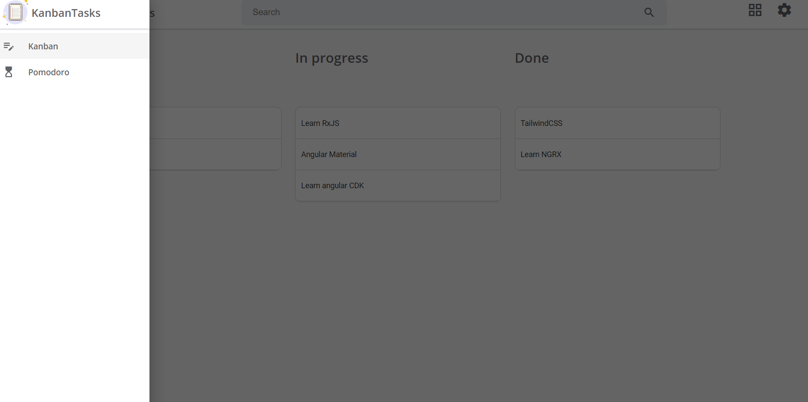
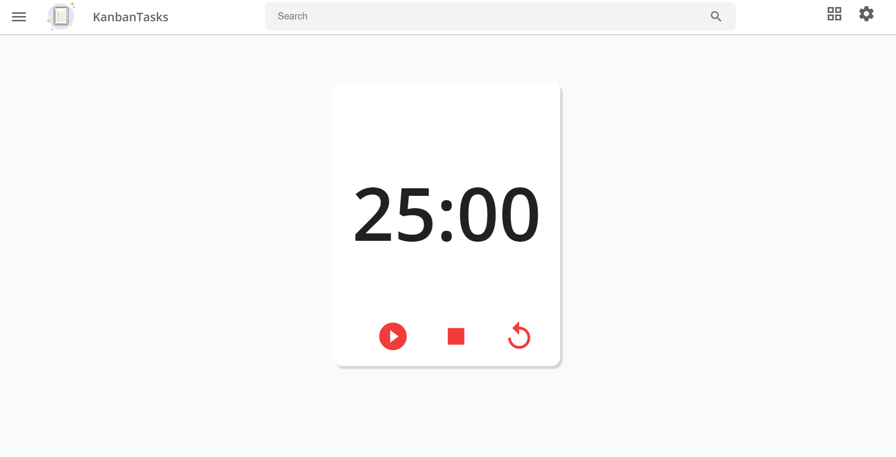

# KanbanTasks

This project is build using Angular, Angular Material, Firebase and enerated with [Angular CLI](https://github.com/angular/angular-cli) version 11.2.0.

# From the app



# Quickstart
## 1. Clone the projet & install dependencies
```bash 
  clone the project
  npm install
```

## 2. Add Firebase config to environments variable
Open /src/environments/environment.ts and add your Firebase configuration. You can find your project configuration in the Firebase Console.
```bash 
  export const environment = {
  production: false,
  firebase: {
    apiKey: '<your-key>',
    authDomain: '<your-project-authdomain>',
    databaseURL: '<your-database-URL>',
    projectId: '<your-project-id>',
    storageBucket: '<your-storage-bucket>',
    messagingSenderId: '<your-messaging-sender-id>',
    appId: '<your-app-id>',
    measurementId: '<your-measurement-id>'
  }
};
  
```

## 3. Serve the project
Open /src/environments/environment.ts and add your Firebase configuration. You can find your project configuration in the Firebase Console.
```bash 
  ng serve
```

  
